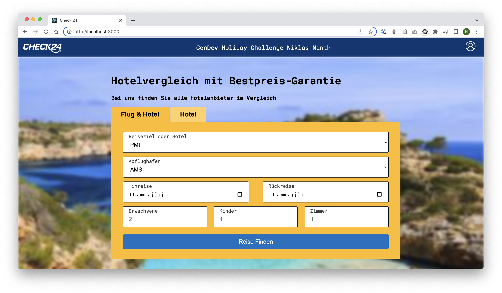
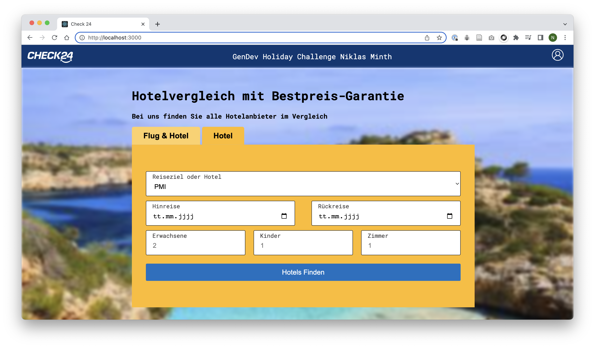
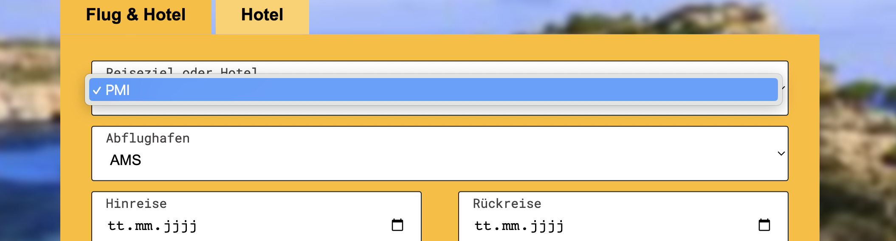
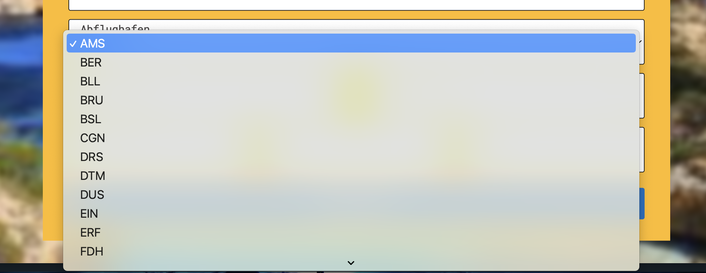
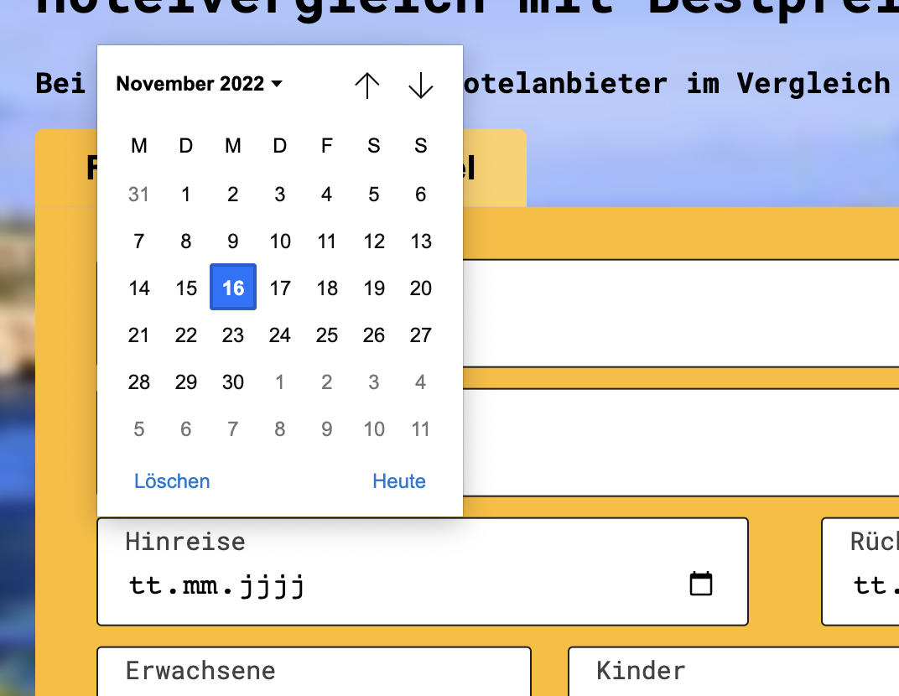
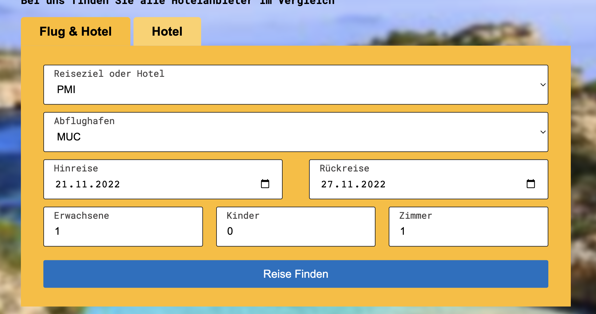
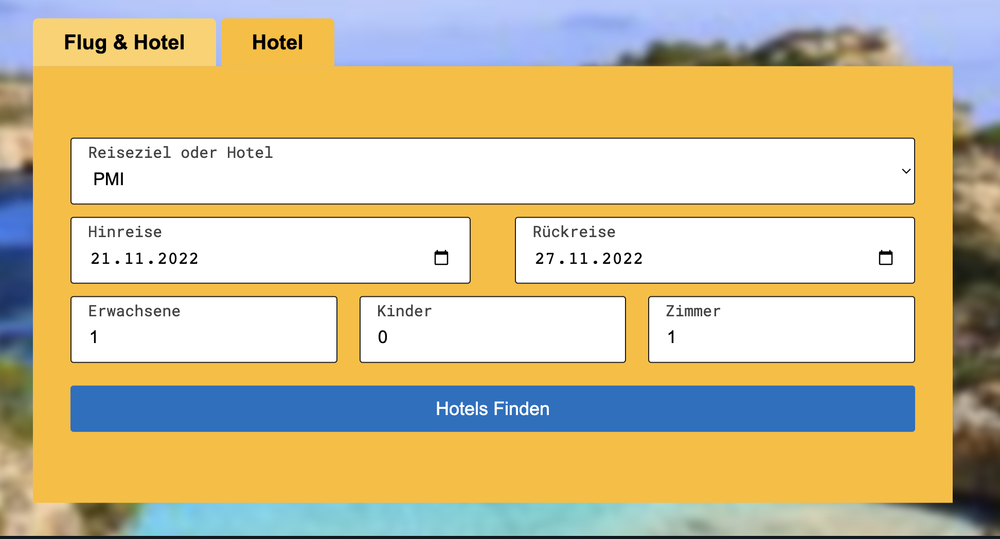
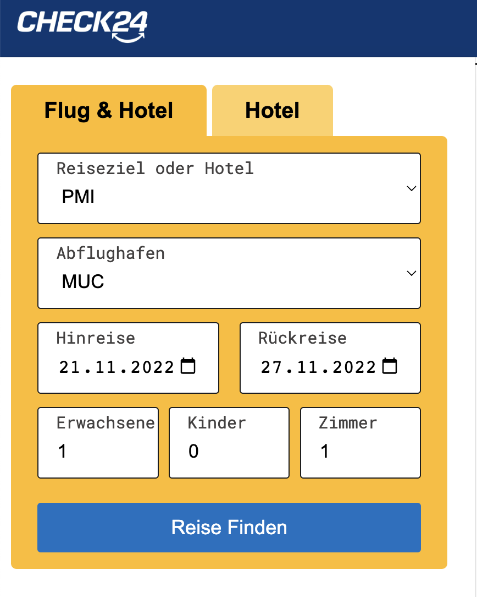
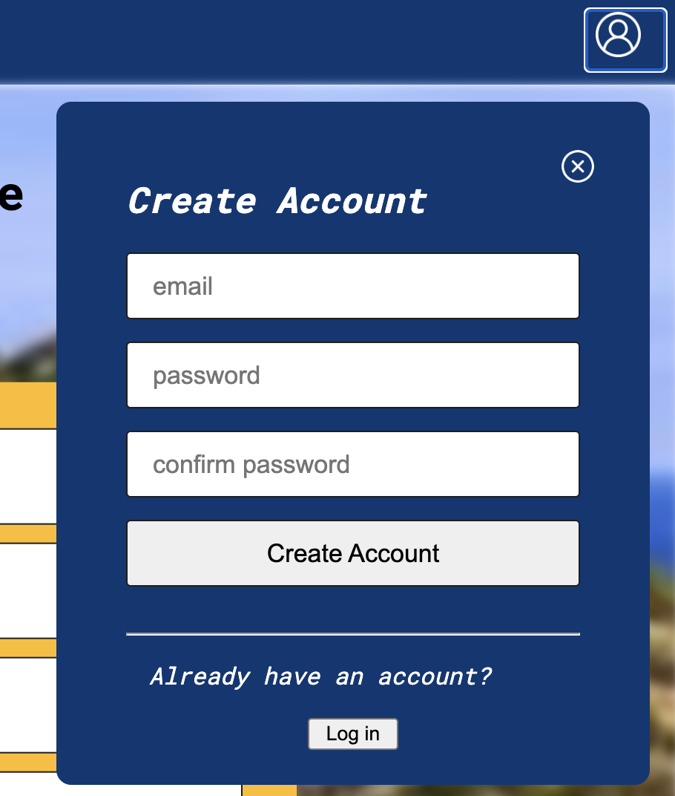

# GenDev Holiday Challenge Niklas Minth

## Projekt
The project is divided into 2 folders. The **client folder** contains the frontend, the **server folder** contains the backend.
The frontend was implemented with the Javascript framework **React JS**, the backend was implemented with **Node Js**.

### Front-End
The project is realized through a website, which is available as a desktop version. Due to the short duration of the project, this version is not yet responsive, meaning that on smaller devices such as smartphones or tablets, the website content may not be displayed properly.

The website has a home page (**Home.js**) where you can see the search box with the user input. The user can choose to search only for hotels, or for hotels&flights. So he can change the search window by clicking on the buttons above.

The destinations and departure airports can be selected via a dropdown, the date via a calendar view and the number of adults, children and rooms via a text field that only accepts numbers. When the user clicks on the blue button and all the fields are filled in, the search is started and the user is redirected to the next page (**ResultPage.js**), where the search window is still displayed on the left side, where entries can still be changed, and the results are displayed on the right side.

#### Inputs:

#### Saved Inputs:
No matter in which search field the data is entered, the data is stored in all fields.

In the navigation bar, clicking on the Check24 logo will take the user to the homepage, and clicking on the profile icon will cause a Login/CreateAccount window to pop up, where the user can create an account or log in.

### Back-End
