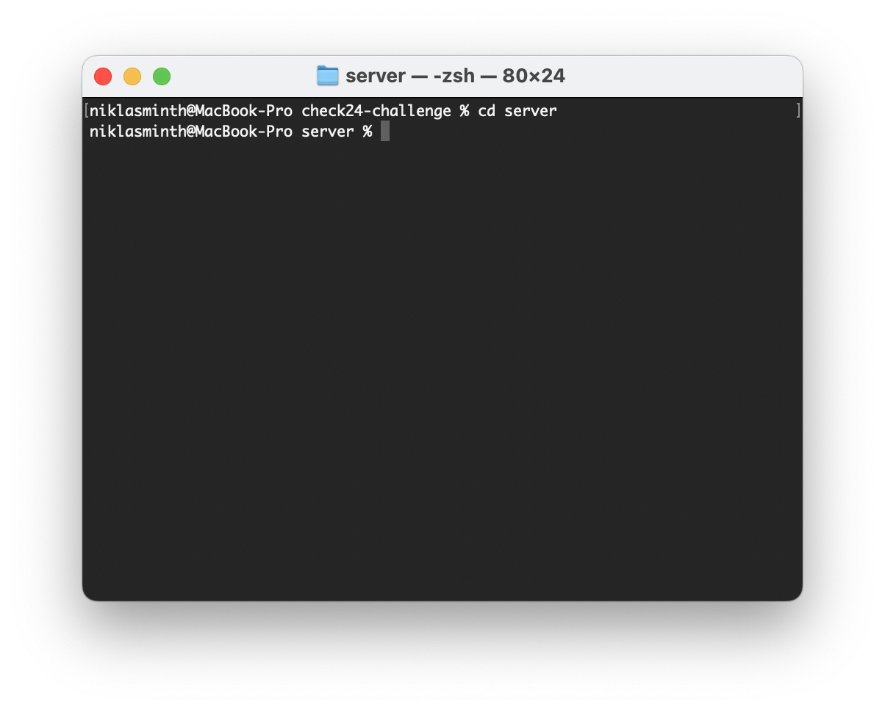

# Documentation how to run the application

## 1 Get the Repository
To run the application, clone the repository with the link (https://github.com/niklas1531/check24-challenge.git) or download the ZIP file. Go to the terminal, navigate to the folder of the project.

## Setup Client Folder
### Navigate into the client folder 

### Run the following commands to install all packages
npm init  
npm i
### Start the application
npm run start

## Setup Server Folder in a second terminal window
### Navigate into the server folder

### Run the following commands to install all packages
npm init  
npm i
### Start the application
npm run start:backend

Now, both the client and server are running and you can use the application
